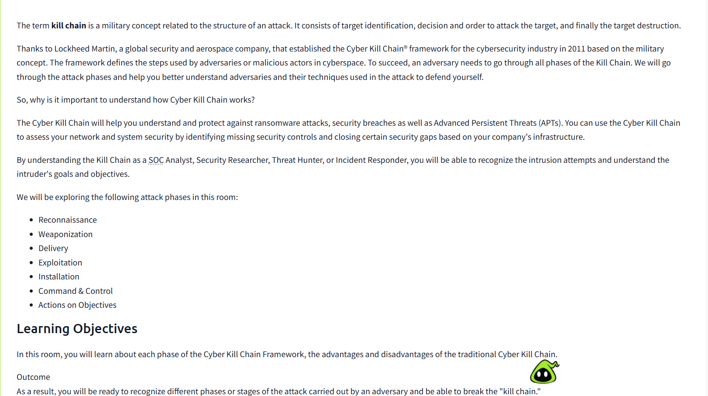
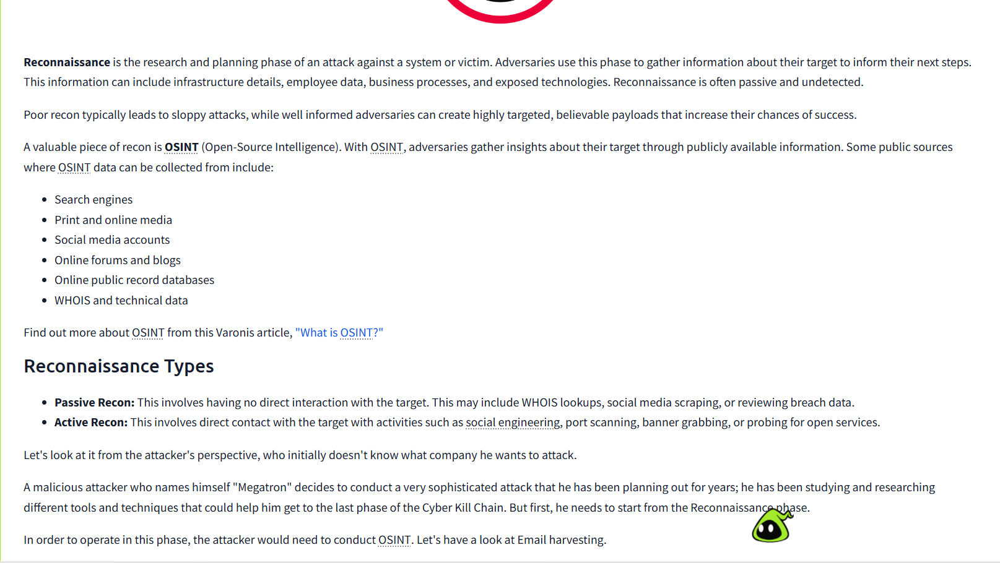
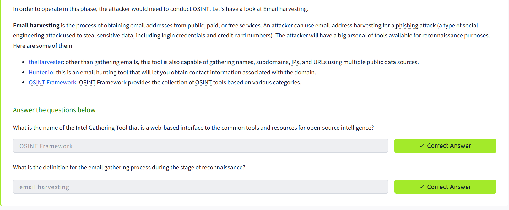
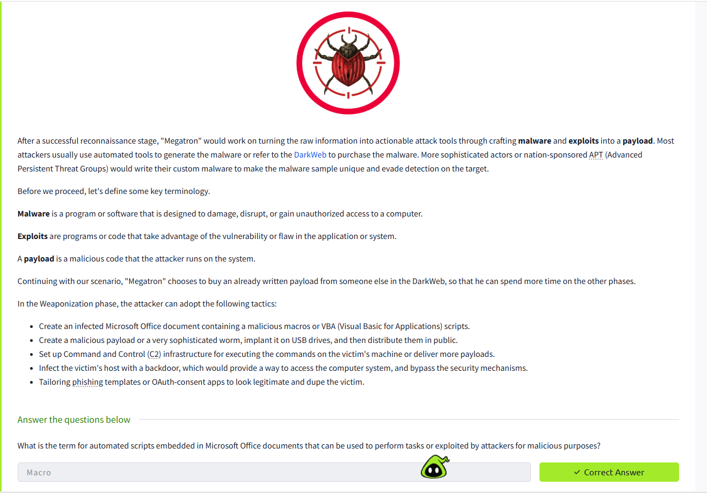
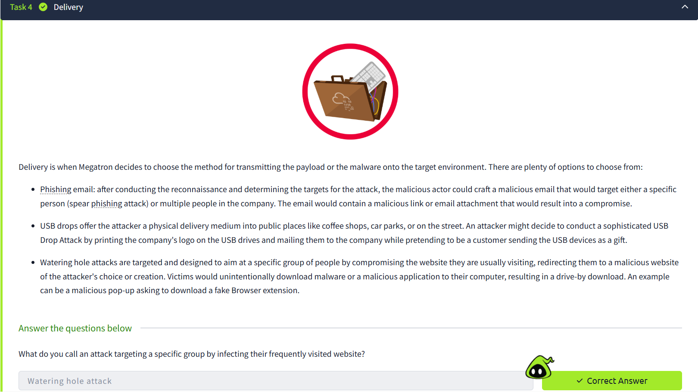
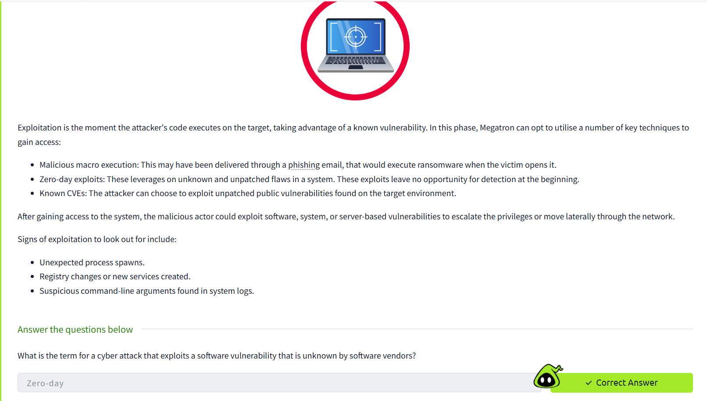
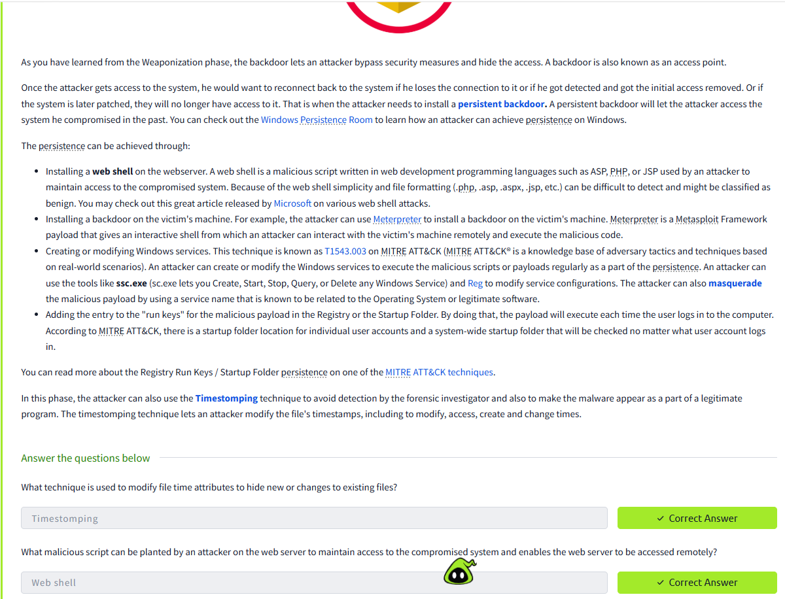
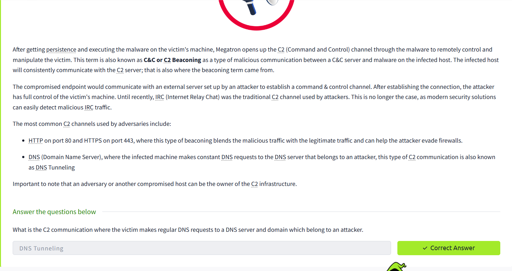
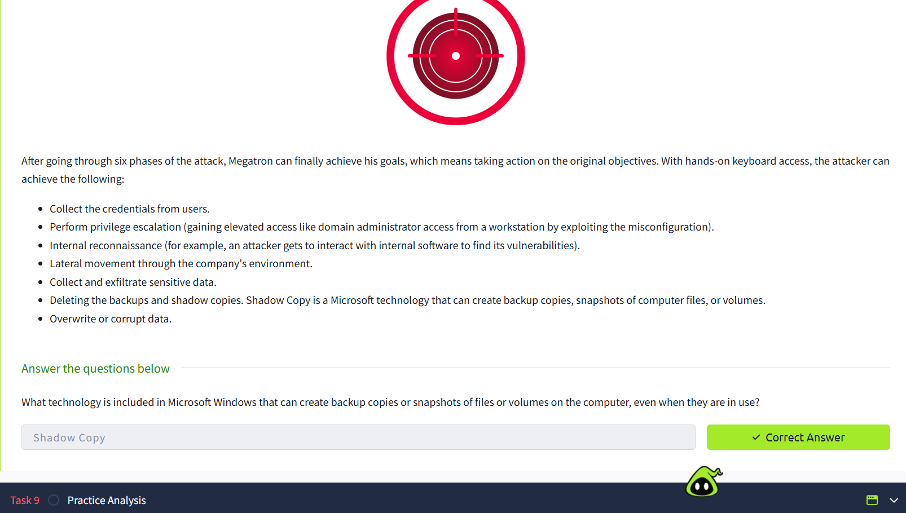
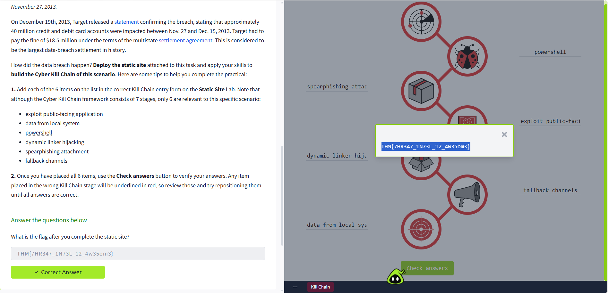

# 📂 Cyber Kill Chain – SOC Analysis Lab & Threat Mapping Lab

## 📌 Project Description

This project describes my accomplishment of the TryHackMe **Cyber Kill Chain** room.

The purpose of this laboratory session was to learn the structure of cyber attacks in general and SOC analysts' responses to them at each stage.

---

# 🧠 What is the Cyber Kill Chain?

The Cyber Kill Chain is a cybersecurity concept aimed at describing the process of a cyber attack from initial reconnaissance to final impact.

It help security teams to detect, analyse , and respond to attacks in various stages.

---

# 🔄 The 7 Stages of the Cyber Kill Chain

## 1. Reconnaissance
- Gathering information about the target
- Examples: scanning, OSINT, finding vulnerabilities

## 2. Weaponization
- Malicious payload creation (malware, exploit)
- Preparing to deliver the attack

## 3. Delivery
- Sending the payload to the victim
- Examples: phishing emails, downloading malicious files

## 4. Exploitation
- Launching the attack against the target
- Exploitation of vulnerabilities or poor credentials

## 5. Installation
- Installation of malware on the system
- Persistence setup

## 6. Command and Control (C2)
- Communication with the compromised system
- Setting remote control connection

## 7. Actions on Objectives
- Attacker's final goal achievement (e.g., stealing data, moving laterally)

---

# 🛡️ SOC Analyst's Perspective

From the SOC analyst's point of view, each stage gives opportunities to identify and prevent the attack:

- Early stages → prevention (Reconnaissance, Delivery)
- Middle stages → detection (Exploitation, Installation)
- Late stages → response (C2, Actions on Objectives)

---

# 🔗 Applying This Model to Real SOC Incidents

This model could be used when investigating real incidents, such as:

- Brute-forced login attempts
- Phishing attacks
- Malware infections

Example:

- Delivery → SSH login attempt from the malicious IP address
- Exploitation → successful attempt to authenticate

---

# 💻 Practical SOC Implementation

The practical application of SOC analysis can be seen through the use of the Cyber Kill Chain.

Here is how the above would be mapped into a practical situation:

- Reconnaissance stage – attackers perform network scanning
- Delivery stage – suspicious login activity or phishing emails
- Exploitation stage – successful login or vulnerabilities exploitation
- Installation stage – persistence is established
- Command and control stage – communication with attacker’s network
- Actions on objectives stage – data is accessed and network system compromised 

This is how the practical structure approach improves detection, analysis, and response efficiency.

---

# 💾 Tools & Concepts Used

- TryHackMe Lab environment
- Cyber Kill Chain concept
- SOC investigation concepts
- Threat detection methodology

---

# 📚 Skills Developed

- Attack lifecycle understanding
- Identifying threats according to attack phases
- SOC analyst's thinking
- Structure of incident investigations
- Cybersecurity frameworks

---

# 🗃️ Key Takeaways

- Each cyber attack goes through several phases
- Early identification decreases negative impacts
- SOC analyst must know how the attacker acts
- Cybersecurity frameworks help to increase investigation quality

---

# 📸 Evidence

